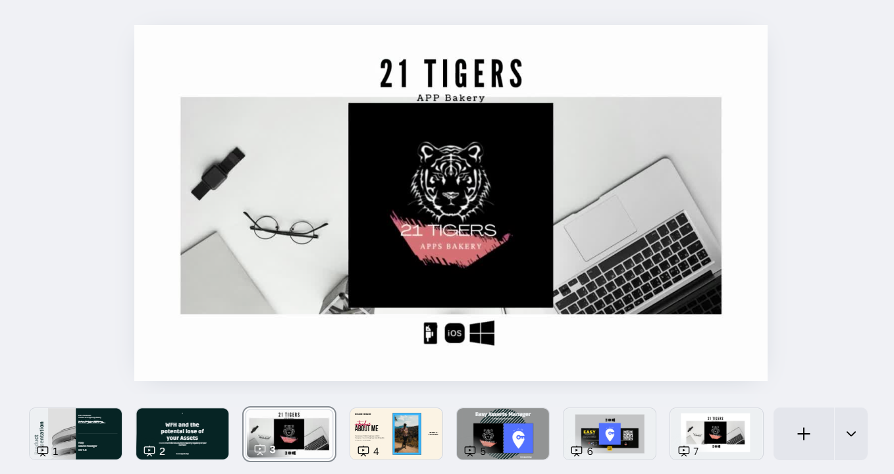

# easy_assets_manager_demo

<p align="center">
  
  [](https://docker.com)
    [](https://docker.com)
    [](https://docker.com)
    [](https://docker.com)
      [](https://docker.com)

  
</p>

This repository demostrates a simple mobile application,
developled entiery in python using a the Kivy Material Design (KivyMD) multi-platform framework as an alternative to the amazing Googles Flutter multi-platform framework that integrates Java/Kotlin for android and Swift for iOS.


This application uses QR based tecnology in order to create catalogs over a simple SQL ERD architectured database, that through SQLAlchemy and pandas, make an API call directly to the database over the always amazing MS SQL Server using stored procedures 'xPs' and returning the data 'realtime' after a simple JOIN Query.

## Technologies that were Used
<p align='center'>
  <a href='https://skillicons.dev'>
    
  </a>
</p>

<p align='center'>
  <a>
    
  </a>
</p>


> Some from the React.js / SASS Front_end UI


> Dedicated Media


The following ```SQL``` Query demostrates the way the simple ```node.js``` backend serves and replies to the userinterface once the QRCode is scanned from the KivyMD textured interface, returning an object that ```pandas``` and ```SQLAlchemy``` libraries then parses and digest into the mobile ```UI```.

```sql
alter procedure ixSP_Leer_QR (@QR nvarchar(100))
as
begin

	select P.Item_ID
	      ,P.QR
	      ,P.Item_DSC
		  ,Q.Category_DSC
		  ,R.Sub_Category_DSC
	from iCAT_Item P inner join iCAT_Category Q     on P.Category_ID=Q.Category_ID
	                 inner join iCAT_Sub_Category R on P.Sub_Category_ID=R.Sub_Category_ID

	where QR=@QR

end

```
The Following code demonstrates how ```pandas``` and ```SQLAlchemy``` ingests the data form the ```Query``` in order to be shown by the mobile ```UI```, using ```exec ixSP``` stored procedures.

```Python
    ########REGISTRSTION SUB_CATEGORIES DROPDOWN FUNCTION
def data_sub_categories(self, *args):
    if not self.SUB_CATEGORIES:
        self.data_sub_categories_raw = pd.read_sql_query(
            "select * from iCAT_Sub_Category ",
            self._Conection())

        self.SUB_CATEGORIES = self.data_sub_categories_raw['Sub_Category_DSC'].to_list()
        return self.SUB_CATEGORIES

    else:
        self.tree_sub_cat_selector = pd.read_sql_query(
            f"select Category_ID from iCAT_Category where Category_DSC='{self.category_requested}'",
            self._Conection())

        self.tree_sub_cat_selected = str(self.tree_sub_cat_selector['Category_ID'][0])

        self.data_sub_categories_raw = pd.read_sql_query(
            f"select * from iCAT_Sub_Category where Category_ID='{self.tree_sub_cat_selected}'",
            self._Conection())

        self.SUB_CATEGORIES = self.data_sub_categories_raw['Sub_Category_DSC'].to_list()

```
Where each cathegory is parsed manually, though it's not the best practices, it served perfectly for prototype popuses. And how ```Stored procedures``` can be invoked from Python Code:

```Python
# //> Initial SQL request manager
def SQL_Main_request(self):
    #//> GENERIC SQL REQUEST :: SPx FOR All Info from Scanner requests! ...
    self._return_code = pd.read_sql_query(
        f'exec ixSP_Read_QR {self._c_getter}',
        self._Conection())

    # //< Selected Tag
    self.menu.ids.list_icon.text = self._return_code['QR'][0]  

    # //< Primary info
    self.menu.ids.list_category.text = self._return_code['Category_DSC'][0]  # //< Tag from Category from
    self.menu.ids.list_sub_category.text = self._return_code['Sub_Category_DSC'][0]  # //< Tag from Category from
    self.menu.ids.list_item_dsc.text = self._return_code['Item_DSC'][0]  # //< Tag from sub_Category from
    self.menu.ids.list_item_cycle_dsc.text = self._return_code['Item_DSC'][0]
    self.Current_Item_ID = self._return_code['Item_ID'][0]

    return self._return_code # //< RAW QUERY OBJECT RETURN
```
For better performance a ```Graphql``` API structure for performances was the best option chosed for the clients final ```MVP```.

Though originally intended for prototype and demo porpuses, at time this porduct was created as so, I did not have the knowledge enough to create native code plug-ins in Dart using the invoke ChannelMethod, also, at the time there were some resources Python had avaiable that wasn't available in Kotlin or Swift.

So this was the perfect moment to give this KivyMD a try and the result exceeded expectations, there are some inconveninces such a the implementation of the buildozer page that required either wsl2 integration for linux distribution or a Virtual machine in order to compile the .aapk file, that in Flutter is no deal.

> Check out the to-client rough demo presentation in canvas

https://www.canva.com/design/DAFz0FiCz-g/-DrBIo2e3CUPbdlYm3dzqw/edit?utm_content=DAFz0FiCz-g&utm_campaign=designshare&utm_medium=link2&utm_source=sharebutton
***(presentantion in page #3)***

> All assets were designed and created in


<p align='center'>
  
  

</p>


